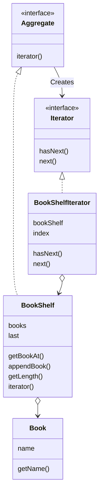

```mermaid
classDiagram
Aggregate <|.. BookShelf
Aggregate --> Iterator: Creates
Iterator <|.. BookShelfIterator
BookShelf o--> Book
BookShelfIterator o--> BookShelf

class Aggregate {
  <<interface>>
  iterator()
}

class Iterator {
  <<interface>>
  hasNext()
  next()
}

class BookShelfIterator {
  bookShelf
  index
  hasNext()
  next()
}

class BookShelf {
  books
  last
  getBookAt()
  appendBook()
  getLength()
  iterator()
}

class Book {
  name
  getName()
}
```