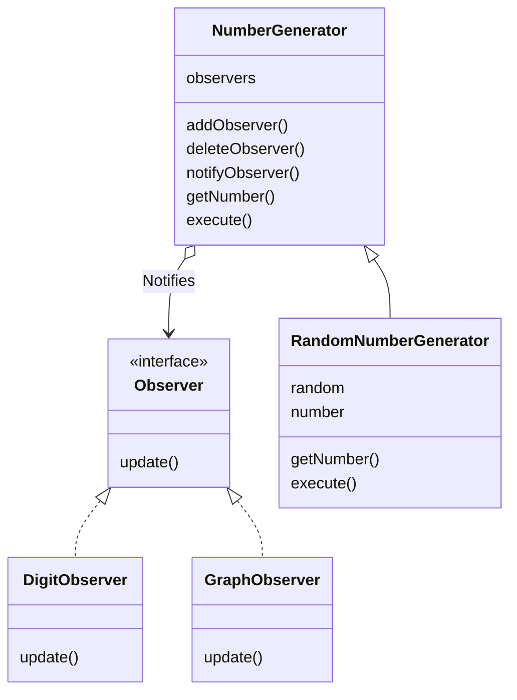

```mermaid
classDiagram

NumberGenerator o--> Observer: Notifies
NumberGenerator <|-- RandomNumberGenerator
Observer <|.. DigitObserver
Observer <|.. GraphObserver

class NumberGenerator {
  observers
  addObserver()
  deleteObserver()
  notifyObserver()
  getNumber()
  execute()
}
class RandomNumberGenerator {
  random
  number
  getNumber()
  execute()
}
class Observer {
  <<interface>>
  update()
}
class DigitObserver {
  update()
}
class GraphObserver {
  update()
}
```